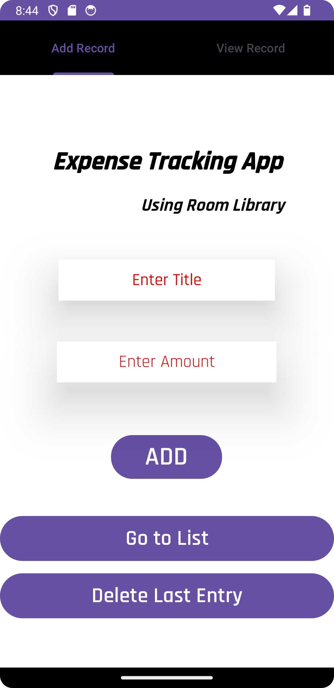

# Expense Tracing App using Room Library


## Description:
Expense Tracing App is an Android application designed to assist users in tracking their expenses efficiently. Utilizing the Room library for local data storage, this app offers a seamless experience for managing expenses. It provides functionalities for adding records, viewing records, navigating to the list, and deleting the last entry.

## Screenshot:




## Features:

- **Room Library Integration:** Utilizes Room library for efficient local data storage, ensuring reliability and performance in expense tracking.

- **Add Record:** Allows users to add expense records effortlessly, providing a convenient interface to input expense details.

- **View Record:** Enables users to view their expense records, facilitating easy monitoring of spending habits and patterns.

- **Navigation to List:** Provides a seamless transition to the expense list, allowing users to access and manage their recorded expenses conveniently.

- **Delete Last Entry:** Offers the functionality to delete the last expense entry, providing users with flexibility in managing their expense records.

---

## Installation:

## Installation:

1. **Clone Repository:** Clone this repository to your local machine:
   ```sh
   git clone https://github.com/RishiMatura/Expense_Tracing_Tab_Layout.git
2. **Open in Android Studio:** Import the project into Android Studio.

3. **Build and Run:** Build the project and run it on an Android emulator or physical device.

---

## Usage:

1. **Add Record:**
- Tap the "Add Record" button to add a new expense entry.
- Enter the expense details in the provided fields.
- Save the record.

2. **View Record:**
- Tap the "View Record" button to access the list of recorded expenses.
- Navigate through the list to view individual expense entries.

3. **Navigation to List:**
- Use the navigation button to move to the list view.
- Access all recorded expenses for further management.

4. **Delete Last Entry:**
- Tap the "Delete Last Entry" button to remove the most recent expense record from the list.


---

## Contributing:
We welcome contributions from the community to enhance the functionality and usability of the Expense Tracing App.

---


## Acknowledgments:
We would like to express our gratitude to the developers and contributors of the Room library for their invaluable contribution to this project.

---

Thank you for choosing Expense Tracing App for managing your expenses effectively!

